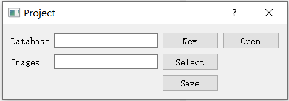
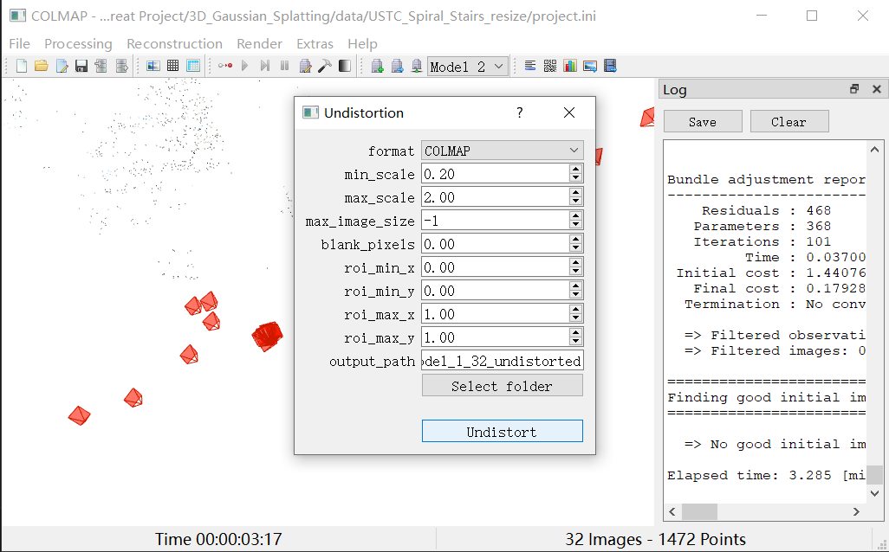

# 3D-GS入门：从自建数据集到训出自己的3D模型


## 配置环境
- 3d-gs环境
- COLMAP

## 自建数据集
> 以下内容为图形化界面建数据集，命令行界面建数据集参见原项目README部分调整好自己数据集格式后，运行`convert.py`即可

### 准备图片
首先准备好一个仅含图片的数据集，结构如下：
```txt
<dataset_name>
└── images
    ├── xxx.jpg 
    └── ...
```

### 新建项目
运行`COLMAP.bat`，打开COLMAP。

点击`File`->`New Project`，新建数据库`database.db`，并选择图片路径初始化项目。



点击`File`->`Save Project`保存项目，并记得在每次更改项目配置时保存。


### Feature Extraction
点击`Processing`->`Feature Extraction`，`Camera Model`选择`OPENCV`，并点击`Extract`开始提取特征。

### Feature Matching
点击`Processing`->`Feature Matching`，选择`Exhaustive`，并点击`Run`开始匹配特征。

这一步耗时较长。

### Reconstruction
点击`Reconstruction`->`Start Reconstruction`即可。


### Undistortion
点击`Extras`->`Undistortion`，选择输出文件夹开始去畸变。



### 处理数据集格式
上一步的输出就是数据集，只不过还需要加上一点点处理。我们将`sparse`文件夹下内容移至`sparse/0`下，完成数据集构建

## 训练模型
以下三个命令，分别为训练、渲染、跑指标，三步前后依赖：
```bash
python train.py -s <dataset_path> --eval # Train with train/test split
python render.py -m <model_path> -s <dataset_path> # Generate renderings
python metrics.py -m <model_path> # Compute error metrics on renderings
```

上述命令中，`<dataset_path>`为数据集路径，如`<project_path>/data/tandt_db/tandt/train`；`<model_path>`为模型路径，如`<project_path>/output/ff83e58f-9`。


